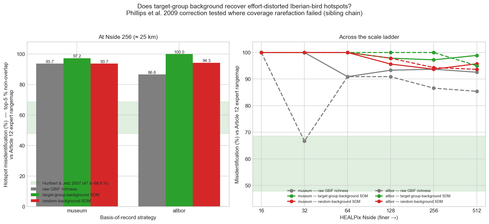

# sdm-hotspot-spatial-effort

> **Sample selection bias and presence-only distribution models: implications for background and pseudo-absence data** — replication study.
>
> Reference paper: [10.1890/07-2153.1](https://doi.org/10.1890/07-2153.1)

This repository is a self-contained replication of the headline claim from the reference paper above. It produces:

- A reproducible computational pipeline (Snakefile + notebooks).
- A FORRT-tagged nanopublication chain on the [Science Live platform](https://platform.sciencelive4all.org), documenting the claim, the replication design, and the outcome with full provenance.
- A Zenodo-archived release (source + container image) with a citable DOI.

## Result — Contradicted

Testing whether Phillips et al. (2009)'s target-group-background correction restores biodiversity-hotspot identity for Iberian breeding birds: at the Hurlbert & Jetz reference scale (HEALPix-NESTED Nside 256, ≈ 25 km), top-5% richness hotspots from target-group-background species-distribution models disagree with the EU Article 12 expert-rangemap gold standard at **97.2 %** (museum) / **100.0 %** (all-observations) symmetric set non-overlap — *worse* than uncorrected raw GBIF richness (93.7 % / 86.6 %), and nowhere near the H&J reference range of 47.8–68.6 %. Robust to the MaxEnt feature set.

Effort bias in *which cells rank as hotspots* is a spatial sampling-location problem that per-species modelling cannot fix — even though the same method demonstrably improves per-species AUC (reproduced, Validated, in the companion repo [`sdm-phillips-reproduction`](https://github.com/annefou/sdm-phillips-reproduction)).



## Quick start

```bash
git clone https://github.com/annefou/sdm-hotspot-spatial-effort.git
cd sdm-hotspot-spatial-effort
pixi install
pixi run snakemake --cores 1
```

Or with Docker:

```bash
docker run --rm ghcr.io/annefou/sdm-hotspot-spatial-effort:latest
```

## Structure

- `paper/` — the source paper PDF (drop yours in there).
- `notebooks/` — jupytext `.py` notebooks that drive the pipeline.
- `data/` — downloaded by `notebooks/01_data_download.py`, never committed.
- `nanopubs/` — drafts of the FORRT chain field-by-field, plus the published-URI registry.
- `docs/` — operating manuals (FORRT form fields, chain decision tree, claim-type vocabulary).
- `figures/` — curated figures used in the Jupyter Book.

## Nanopublication chain

This replication's claim, design, and outcome are published as a six-step FORRT chain on the [Science Live platform](https://platform.sciencelive4all.org) (full registry, including superseded steps, in [`nanopubs/PUBLISHED.md`](nanopubs/PUBLISHED.md)):

1. [Quote-with-comment](https://w3id.org/sciencelive/np/RAa_SMf7gCi0BbpMSh0hng3o9bYxtuJPfHz-ypXlXK9KQ) — Phillips' target-group-background mechanism
2. [AIDA sentence](https://w3id.org/sciencelive/np/RAKggxL7Un0PTf5L8-X0tiDDcyYTE1MySjpLX7DDsuPOY)
3. [FORRT Claim](https://w3id.org/sciencelive/np/RAKrH1DpRI7L9d7D4EMyGDDJ9iSDOVWo4-zezUPqyVBxo)
4. [Replication Study](https://w3id.org/sciencelive/np/RA6bPD5TPlWXC6jrgnIF-Yh5sbGnurByDMJGQOoQCVz6c)
5. [Replication Outcome](https://w3id.org/sciencelive/np/RA4q2J-h_UpFpeLTeL_DS8p7j7EOBCes4L1G1eOBfJiDo) — **Contradicted**
6. [CiTO Citation](https://w3id.org/sciencelive/np/RA7151bPt5TSSTxi-sWGmZhUOHcqaSzevzhhD4QxmfURI)

The CiTO `extends` the sibling chain [`sdm-hotspot-effort-correction`](https://github.com/annefou/sdm-hotspot-effort-correction) (coverage rarefaction — also Contradicted) and `credits` the method-validation companion [`sdm-phillips-reproduction`](https://github.com/annefou/sdm-phillips-reproduction); the family roots on Hurlbert & Jetz 2007 via [`sdm-scale-replication`](https://github.com/annefou/sdm-scale-replication).

## Citation

If you use this work, please cite both:

- This software: [`CITATION.cff`](CITATION.cff) → DOI [10.5281/zenodo.20465140](https://doi.org/10.5281/zenodo.20465140).
- The original paper: [10.1890/07-2153.1](https://doi.org/10.1890/07-2153.1).
